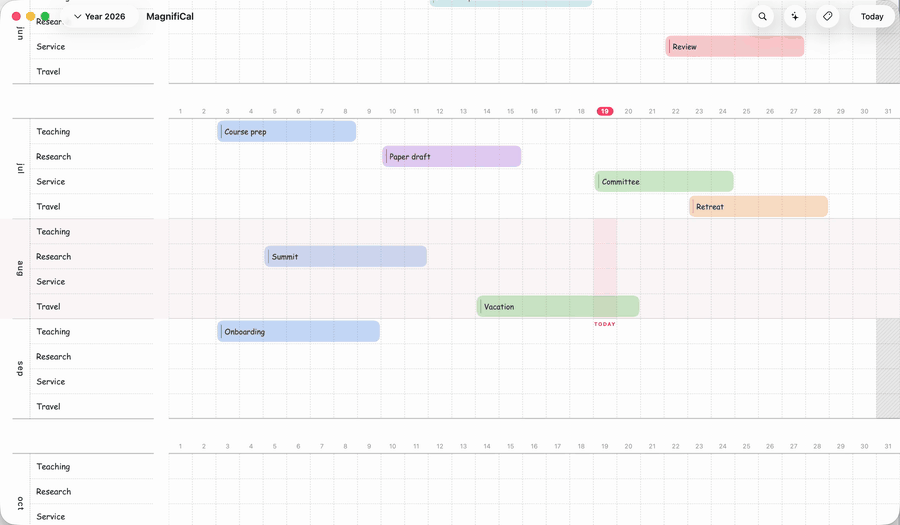
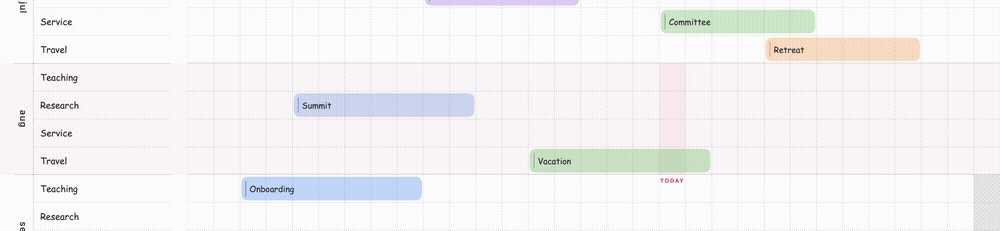
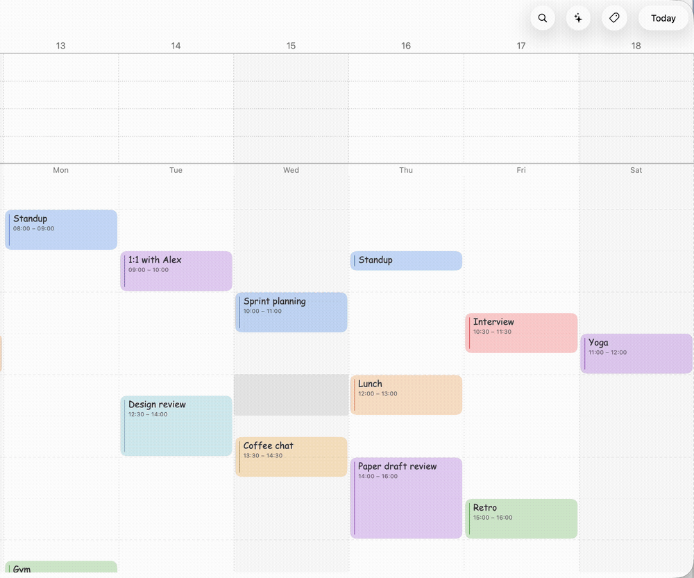

  

<h1 align="center">MagnifiCal</h1>

MagnifiCal is a calendar for Mac that you navigate by zooming.

  <picture>
    <source media="(prefers-color-scheme: dark)" srcset="MagnifiCalKit/media/readme/pinch-zoom-dark.gif">
    
  </picture>

## What it does

- **One continuous canvas.** Pinch to glide from the whole year down to a single day — the calendar re-forms as you zoom instead of switching between separate screens.
- **The big picture and the small one.** Trips, deadlines, and long-running plans stretch across the year view; your day's schedule sits on an hourly timeline.
- **Notes and to-dos, everywhere.** Every event and every day can hold notes and checklists, and dashboards gather them up: a to-do list, a notepad, and a timeline for each of your projects.
- **Your calendar stays yours.** Everything lives on your own Mac and syncs to your other devices through your own iCloud. No accounts, no servers, no tracking.
- **Plays well with your other calendars.** See your Apple Calendar, Google Calendar, and Outlook events alongside your own — hide, recolor, or annotate them without changing the originals.
- **An optional AI assistant.** Ask questions about your schedule or have it make changes for you. It's entirely optional and off until you set it up.
- **At home on your devices.** Works on macOS 15 and later, with a companion iPhone app for viewing your calendar on the go.

  <picture>
    <source media="(prefers-color-scheme: dark)" srcset="MagnifiCalKit/media/readme/band-year-dark.gif">
    
  </picture>
  <picture>
    <source media="(prefers-color-scheme: dark)" srcset="MagnifiCalKit/media/readme/markdown-notes-dark.gif">
    
  </picture>

## Getting MagnifiCal

- Download it free from the [releases page](../../releases/latest) — it keeps itself up to date.
- Or get it on the Mac App Store — the same app; buying it is a way to support development.
- The iPhone companion is available through TestFlight.

## Contributing

MagnifiCal is free, open-source software, and contributions are always welcome — bug reports, ideas, or code. See [CONTRIBUTING.md](CONTRIBUTING.md) to get started; issues labeled [`good first issue`](../../labels/good%20first%20issue) are a good place to begin.

## License

MagnifiCal is released under [GPL-3.0](LICENSE).
