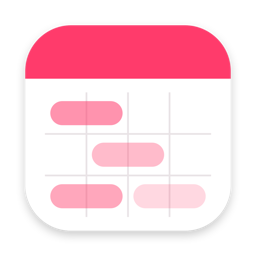
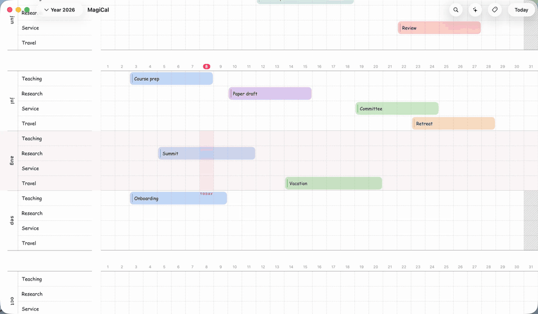
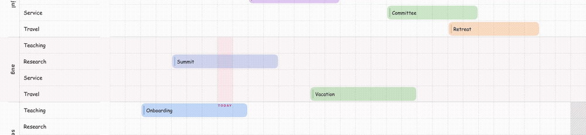
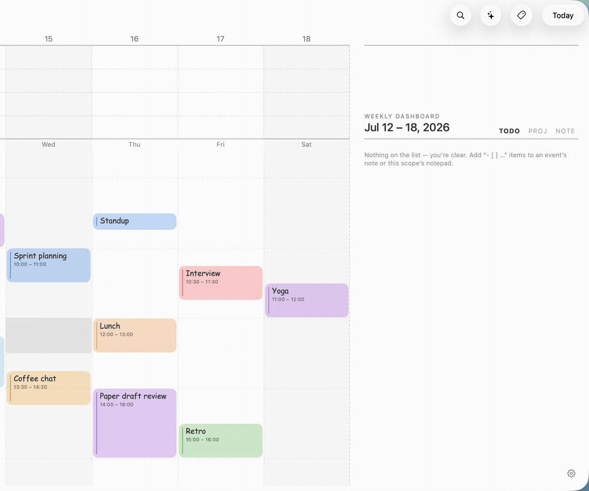

<p align="center">
  
</p>

<h1 align="center">MagnifiCal</h1>

<p align="center">MagnifiCal is a calendar for macOS that you navigate by zooming.</p>

<p align="center">
  <picture>
    <source media="(prefers-color-scheme: dark)" srcset="MagnifiCalKit/Sources/CalendarUI/Resources/tutorial/pinch-zoom-dark.gif">
    
  </picture>
</p>

## Features

- One continuous canvas: pinch between year, month, week, and day — the layout re-forms at each level instead of switching screens.
- Multi-day events live on year-view track lanes; timed events on the week and day timelines.
- Every event and every day holds Markdown notes with to-do items; dashboards collect them into a TODO list, a notes editor, and project gantt views (⌘B / ⌘E / ⌘J).
- Local-first: your data is on-disk JSON, synced across your Macs and iPhone through your own iCloud. No accounts, no servers, no analytics.
- Shows your Apple Calendar, Google Calendar, and Outlook events read-only — hide, recolor, annotate, or promote them without touching the originals.
- An optional AI assistant that reads and edits the calendar through audited tools, using any OpenAI-compatible endpoint with keys you provide (stored in the macOS Keychain).
- Designed for macOS 15 and above, with Liquid Glass rendering on macOS 26.

<p align="center">
  <picture>
    <source media="(prefers-color-scheme: dark)" srcset="MagnifiCalKit/Sources/CalendarUI/Resources/tutorial/band-year-dark.gif">
    
  </picture>
  <picture>
    <source media="(prefers-color-scheme: dark)" srcset="MagnifiCalKit/Sources/CalendarUI/Resources/tutorial/markdown-notes-dark.gif">
    
  </picture>
</p>

## Getting MagnifiCal

You can get MagnifiCal through several sources:

- The [releases page](../../releases/latest) — a notarized DMG.
- The Mac App Store — identical to the free version; a way to support development.
- Building from source (below).

MagnifiCal is free software. Its iPhone companion (a read-only viewer) is available through TestFlight.

## Building from source

The calendar itself lives in a Swift package; the app targets are thin shells around it.

```sh
# Engine, renderer, and UI — no signing required:
cd MagnifiCalKit
swift build && swift test

# The macOS and iOS apps:
open MagnifiCalApp/MagnifiCalApp.xcodeproj
```

The package layering is the map: `CalendarGeometry` (pure layout math) → `CalendarEngine` (state, persistence, sync) → `CalendarRender` (canvas renderer) → `CalendarUI` (shell). Design notes for each subsystem are in `docs/`.

## Contributing

MagnifiCal is always looking for contributions, whether through bug reports, code, or ideas — see [CONTRIBUTING.md](CONTRIBUTING.md) for the build/test workflow and what makes a PR easy to merge. Issues labeled [`good first issue`](../../labels/good%20first%20issue) are a reasonable place to start. Contributions include a one-time CLA signature, handled automatically on the pull request.

## License

MagnifiCal is released under [GPL-3.0](LICENSE).
